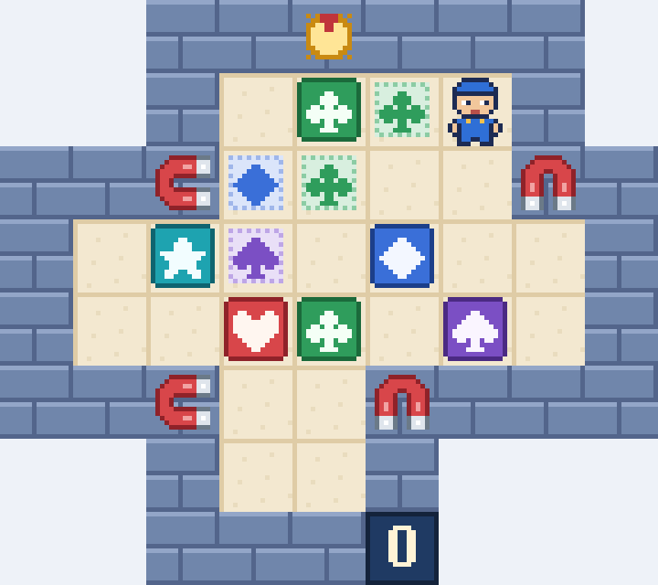

# La Baraja Magnética

Seis cajas de cinco palos (corazón, trébol, diamante, pica y estrella), cuatro imanes que clavan la caja que miran y
un interruptor que los hace girar. Juego web autónomo en **PuzzleScript Next**, con pixel-art 16-bit propio y
tarjetas ilustradas con todas las reglas.

**▶ Jugar:** https://spyder-cripto.github.io/la-baraja-magnetica/

## Cómo se juega
- **Objetivo:** lleva cada caja a la diana de su palo (hay dos tréboles). Una caja en su diana se vuelve de oro.
- **Flechas:** mover · **Z:** deshacer · **R:** reiniciar.
- **En el móvil:** desliza el dedo para moverte; deshacer y reiniciar están en la pestaña del borde izquierdo.
- Se empuja una sola caja cada vez y no se puede tirar de ellas.
- **Imanes:** clavan la casilla a la que miran sus polos; la caja que está ahí no se mueve (sí puede entrar otra).
- **Interruptor:** camina contra el sol del muro de arriba para girar todos los imanes un cuarto de vuelta; no cuesta pasos.
- **Contador de pasos:** empieza en 0 con una sola cifra y crece (decenas a los 10, centenas a los 100, millares a los 1000).
- Dentro del juego, el botón **«Cómo se juega»** abre las tarjetas con las reglas y las piezas.

**El reto:** llevar cada caja a su sitio con los menos pasos posibles.

## Créditos
- Recreación, arte 16-bit y tarjetas: **Spider** (Fali + Claude), 2026
- Nivel original: kjs722 («Impossible #1», sokobanonline.com, 2019)
- Motor: [PuzzleScript Next](https://github.com/david-pfx/PuzzleScriptNext) (derivado de PuzzleScript de increpare), incrustado en un único `index.html`
- Fuente del juego: [`juego.txt`](juego.txt)
